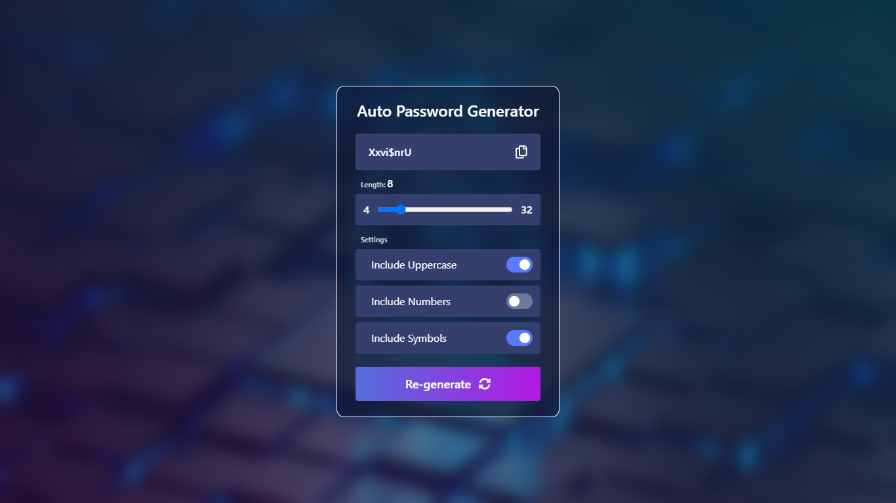

# Password Generator Pro

It is a very useful tool to generate secure passwords quickly. You can include numbers, symbols, uppercase & lowercase symbols. You just have to specify the length and all done.

## Table of Contents

- [Demo](#demo)
- [Features](#features)
- [Installation](#installation)
- [Usage](#usage)
- [Contributing](#contributing)
- [Contact](#contact)

## Demo

### [Live Demo](https://raunak7t.github.io/password-generator-pro/)

[](https://raunak7t.github.io/password-generator-pro/)

## Features

- Include numbers, symbols, uppercase & lowercase symbols
- Choose the length
- Copy easily
- Instant renew on tweeking options
- Re-generate to find best fit for you
- And many more...

## Installation

### Prerequisites

- Node.js
- npm or yarn

### Clone the Repository

```bash
git clone https://github.com/Raunak7t/password-generator-pro.git
cd password-generator-pro
```

### Install Dependencies

Using npm:

```bash
npm install
```

or

```bash
npm i
```

Or using yarn:

```bash
yarn install
```

## Usage

### Running Locally

To start the development server:

Using npm:

```bash
npm run dev
```

or

```bash
npm start
```

Or using yarn:

```bash
yarn start
```

Open [http://localhost:3000](http://localhost:3000) to view it in the browser.

### Building for Production

To create a production build:

Using npm:

```bash
npm run build
```

Or using yarn:

```bash
yarn build
```

## Contributing

Contributions are welcome!

### Steps to Contribute

1. Fork the repository
2. Create a new branch (`git checkout -b feature-branch`)
3. Make your changes
4. Commit your changes (`git commit -m 'Add some feature'`)
5. Push to the branch (`git push origin feature-branch`)
6. Open a pull request

## Contact

Raunak - [raunak7t@gmail.com](mailto:raunak7t@gmail.com)

Project Link: [https://github.com/Raunak7t/password-generator-pro](https://github.com/Raunak7t/password-generator-pro)
